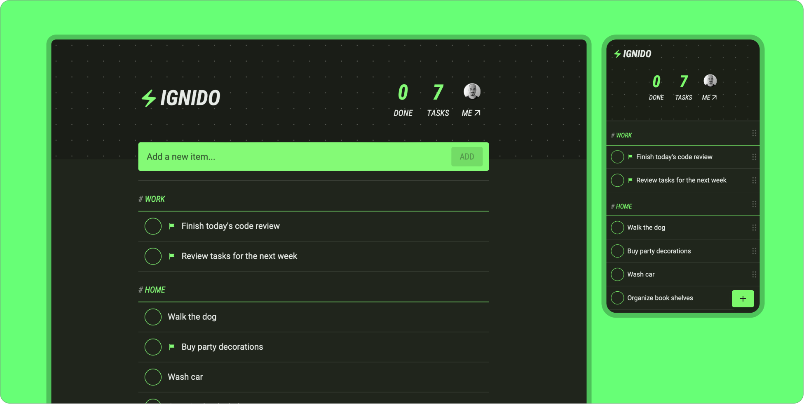
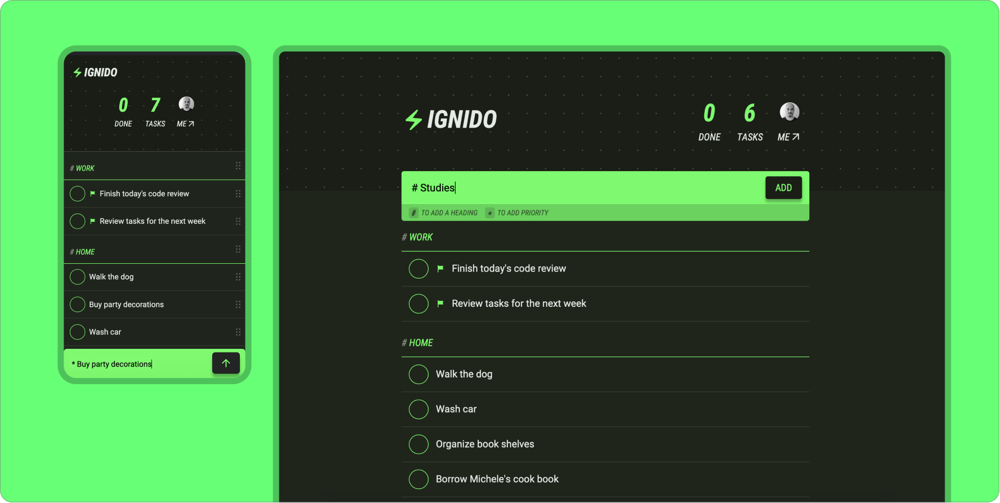
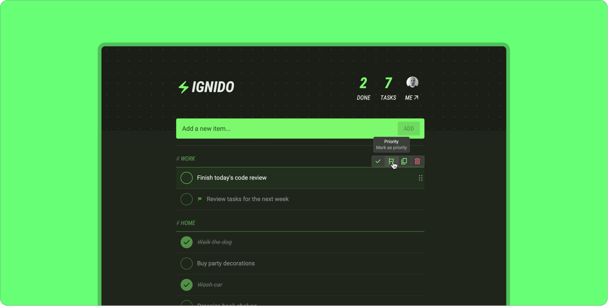

# Ignido App

- [About](#about)
  - [Tools](#tools)
  - [Features](#implemented-features)
- [Showcase](#showcase)
- [Installing and running](#installing-and-running)
- [Extra notes](#extra-notes)

 

### Tools used

`Typescript` `ReactJS` `Vite` `react-responsive` `Framer Motion` `Radix UI` `SASS`

 

### Implemented features

- ✅ Inline editing
- ✅ Drag to reorder
- ✅ Data persistency in local storage
- ✅ Special syntax to create headings (#) and priority tasks (\*)
- ✅ Create, duplicate, and delete to-do items

 

## Showcase

 

 

 

## Installing and running

- After cloning the project, run `npm i` to install the dependencies
- Use `npm run dev` to start the development server locally and `npm run build` to generate the project build

---

_Check out package.json for more scripts._

 

## Extra notes

- This project is purely a practical exercise intended for developing and/or showcasing my skills in the tools/techniques/concepts mentioned above. It's not meant to be a complete production-ready solution. If you have any questions or simply want to chat about it, feel free to reach out!
